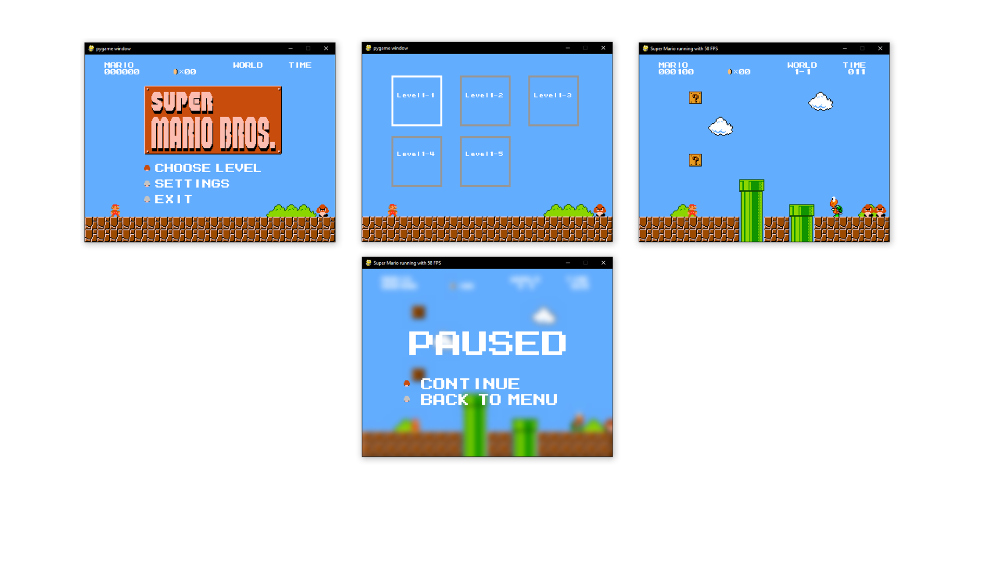

# Super Mario Implementation in Python

This is inspired by Meth-Meth-Method's [super mario game](https://github.com/meth-meth-method/super-mario/)

## Running

* $ pip install -r requirements.txt
* $ python main.py

## Standalone windows build

* $ pip install py2exe
* $ python compile.py py2exe

## Controls

* Left: Move left  
* Right: Move right  
* Space: Jump  
* Shift: Boost   
* Left/Right Mouseclick: secret   

## Current state:

## Dependencies	
* pygame	
* scipy	

## Contribution

If you have any Improvements/Ideas/Refactors feel free to contact me or make a Pull Request.
The code needs still alot of refactoring as it is right now, so I appreciate any kind of Contribution.
